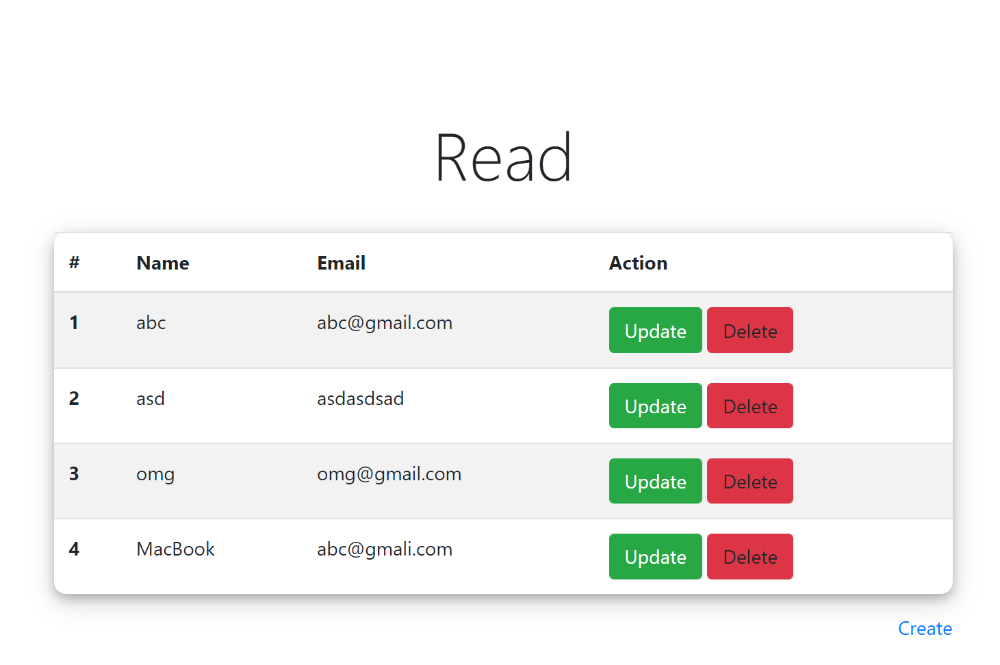
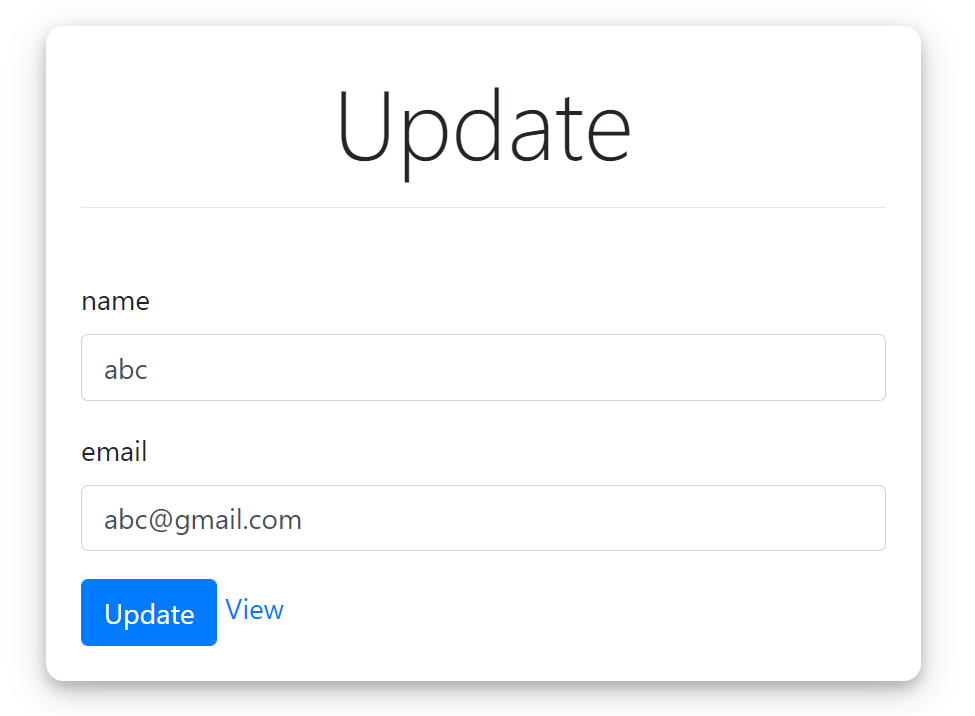
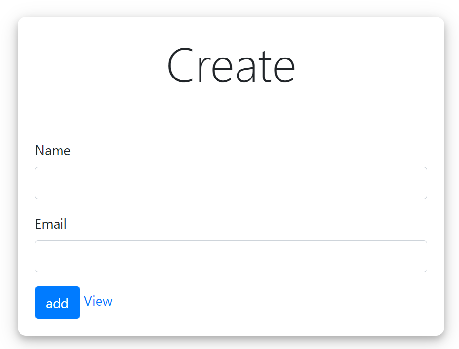

## Project Setup

In order to run the project, setup .env and set MONGO_URI variable equal to DB connection string.

run npm install to setup node_modules.

In order to avoid port collisions, in the source code port value is 8000 || 5000.

program images :

###

####

####
